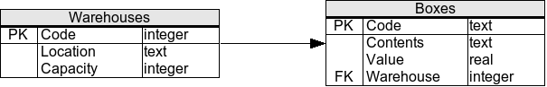

# SQL Practice

## Practice №1 | The Computer store

### Relational Schema


### Table creation code

``` sql
CREATE TABLE Manufacturers (
	Code INTEGER PRIMARY KEY NOT NULL,
	Name CHAR(50) NOT NULL 
);

CREATE TABLE Products (
	Code INTEGER PRIMARY KEY NOT NULL,
	Name CHAR(50) NOT NULL ,
	Price REAL NOT NULL ,
	Manufacturer INTEGER NOT NULL 
		CONSTRAINT fk_Manufacturers_Code REFERENCES Manufacturers(Code)
);
```

### Sample dataset

``` sql
INSERT INTO Manufacturers(Code,Name) VALUES(1,'Sony');
INSERT INTO Manufacturers(Code,Name) VALUES(2,'Creative Labs');
INSERT INTO Manufacturers(Code,Name) VALUES(3,'Hewlett-Packard');
INSERT INTO Manufacturers(Code,Name) VALUES(4,'Iomega');
INSERT INTO Manufacturers(Code,Name) VALUES(5,'Fujitsu');
INSERT INTO Manufacturers(Code,Name) VALUES(6,'Winchester');
INSERT INTO Manufacturers(Code,Name) VALUES(7,'Bose');

INSERT INTO Products(Code,Name,Price,Manufacturer) VALUES(1,'Hard drive',240,5);
INSERT INTO Products(Code,Name,Price,Manufacturer) VALUES(2,'Memory',120,6);
INSERT INTO Products(Code,Name,Price,Manufacturer) VALUES(3,'ZIP drive',150,4);
INSERT INTO Products(Code,Name,Price,Manufacturer) VALUES(4,'Floppy disk',5,6);
INSERT INTO Products(Code,Name,Price,Manufacturer) VALUES(5,'Monitor',240,1);
INSERT INTO Products(Code,Name,Price,Manufacturer) VALUES(6,'DVD drive',180,2);
INSERT INTO Products(Code,Name,Price,Manufacturer) VALUES(7,'CD drive',90,2);
INSERT INTO Products(Code,Name,Price,Manufacturer) VALUES(8,'Printer',270,3);
INSERT INTO Products(Code,Name,Price,Manufacturer) VALUES(9,'Toner cartridge',66,3);
INSERT INTO Products(Code,Name,Price,Manufacturer) VALUES(10,'DVD burner',180,2);
```

## Exercises with answers

1. Select the names of all the products in the store

``` sql
SELECT Name FROM Products;
```

2. Select the names and the prices of all the products in the store

``` sql
SELECT Name, Price FROM Products;
```

3. Select the name of the products with a price less than or equal to $200

``` sql
SELECT Name FROM Products 
WHERE Price <= 200;
```

4. Select all the products with a price between $60 and $120

``` sql
SELECT * FROM Products
WHERE Price BETWEEN 60 AND 120;
```

5. Select the name and price in cents (i.e., the price must be multiplied by 100).

``` sql
 SELECT Name, Price * 100 AS PriceCents FROM Products;
```

6. Compute the average price of all the products

``` sql
SELECT AVG(Price) FROM Products;
```

7. Compute the average price of all products with manufacturer code equal to 2

``` sql
SELECT AVG(Price) FROM Products 
WHERE Manufacturer=2;
```

8. Compute the number of products with a price larger than or equal to $180.

``` sql
SELECT COUNT(*) FROM Products 
WHERE Price >= 180;
```

9. Select the name and price of all products with a price larger than or equal to $180, and sort first by price (in
   descending order), and then by name (in ascending order)

``` sql
SELECT Name, Price 
     FROM Products
    WHERE Price >= 180
 ORDER BY Price DESC, Name;
```

10. Select all the data from the products, including all the data for each product's manufacturer

``` sql
SELECT *
   FROM Products LEFT JOIN Manufacturers
   ON Products.Manufacturer = Manufacturers.Code;
```

11. Select the product name, price, and manufacturer name of all the products

``` sql
SELECT Products.Name, Price, Manufacturers.Name
   FROM Products INNER JOIN Manufacturers
   ON Products.Manufacturer = Manufacturers.Code;
```

12. Select the average price of each manufacturer's products, showing only the manufacturer's code

``` sql
SELECT AVG(Price), Manufacturer
    FROM Products
GROUP BY Manufacturer;
```

13. Select the average price of each manufacturer's products, showing the manufacturer's name

``` sql
SELECT AVG(Price), Manufacturers.Name
   FROM Products INNER JOIN Manufacturers
   ON Products.Manufacturer = Manufacturers.Code
   GROUP BY Manufacturers.Name;
```

14. Select the names of manufacturer whose products have an average price larger than or equal to $150

``` sql
SELECT AVG(Price), Manufacturers.Name
   FROM Products INNER JOIN Manufacturers
   ON Products.Manufacturer = Manufacturers.Code
   GROUP BY Manufacturers.Name
   HAVING AVG(Price) >= 150;
```

15. Select the name and price of the cheapest product

``` sql
 SELECT Name, Price
   FROM Products
   WHERE Price = (SELECT MIN(Price) FROM Products);
```

16. Select the name of each manufacturer along with the name and price of its most expensive product

``` sql
SELECT A.Name, A.Price, F.Name
   FROM Products A INNER JOIN Manufacturers F
   ON A.Manufacturer = F.Code
     AND A.Price =
     (
       SELECT MAX(A.Price)
         FROM Products A
         WHERE A.Manufacturer = F.Code
     );
```

17. Select the name of each manufacturer which have an average price above $145 and contain at least 2 different
    products

``` sql
Select m.Name, Avg(p.price) as p_price, COUNT(p.Manufacturer) as m_count
FROM Manufacturers m, Products p
WHERE p.Manufacturer = m.code
GROUP BY p.Manufacturer
HAVING p_price >= 150 and m_count >= 2;
```

18. Add a new product: Loudspeakers, $70, manufacturer 2

``` sql
INSERT INTO Products( Code, Name , Price , Manufacturer)
  VALUES ( 11, 'Loudspeakers' , 70 , 2 );

```

19. Update the name of product 8 to "Laser Printer"

``` sql
 UPDATE Products
   SET Name = 'Laser Printer'
   WHERE Code = 8;
```

20. Apply a 10% discount to all products

``` sql
UPDATE Products
   SET Price = Price - (Price * 0.1);
```

21. Apply a 10% discount to all products with a price larger than or equal to $120

``` sql
UPDATE Products
   SET Price = Price - (Price * 0.1)
   WHERE Price >= 120;
```

## Practice №2 | The Warehouse

### Relational Schema



### Table creation code

``` sql
CREATE TABLE Manufacturers (
    Code INTEGER PRIMARY KEY NOT NULL,
    Name CHAR(50) NOT NULL
);

CREATE TABLE Products (
    Code INTEGER PRIMARY KEY NOT NULL,
    Name CHAR(50) NOT NULL ,
    Price REAL NOT NULL ,
    Manufacturer INTEGER NOT NULL
        CONSTRAINT fk_Manufacturers_Code REFERENCES Manufacturers(Code)
);
```

### Sample dataset

``` sql
    INSERT INTO Manufacturers(Code,Name) VALUES(1,'Sony');
INSERT INTO Manufacturers(Code,Name) VALUES(2,'Creative Labs');
INSERT INTO Manufacturers(Code,Name) VALUES(3,'Hewlett-Packard');
INSERT INTO Manufacturers(Code,Name) VALUES(4,'Iomega');
INSERT INTO Manufacturers(Code,Name) VALUES(5,'Fujitsu');
INSERT INTO Manufacturers(Code,Name) VALUES(6,'Winchester');
INSERT INTO Manufacturers(Code,Name) VALUES(7,'Bose');

INSERT INTO Products(Code,Name,Price,Manufacturer) VALUES(1,'Hard drive',240,5);
INSERT INTO Products(Code,Name,Price,Manufacturer) VALUES(2,'Memory',120,6);
INSERT INTO Products(Code,Name,Price,Manufacturer) VALUES(3,'ZIP drive',150,4);
INSERT INTO Products(Code,Name,Price,Manufacturer) VALUES(4,'Floppy disk',5,6);
INSERT INTO Products(Code,Name,Price,Manufacturer) VALUES(5,'Monitor',240,1);
INSERT INTO Products(Code,Name,Price,Manufacturer) VALUES(6,'DVD drive',180,2);
INSERT INTO Products(Code,Name,Price,Manufacturer) VALUES(7,'CD drive',90,2);
INSERT INTO Products(Code,Name,Price,Manufacturer) VALUES(8,'Printer',270,3);
INSERT INTO Products(Code,Name,Price,Manufacturer) VALUES(9,'Toner cartridge',66,3);
INSERT INTO Products(Code,Name,Price,Manufacturer) VALUES(10,'DVD burner',180,2);
```

## Exercises with answers

1. Select the names of all the products in the store

``` sql
SELECT Name FROM Products;
```

2. Select the names and the prices of all the products in the store

``` sql
SELECT Name, Price FROM Products;
```

3. Select the name of the products with a price less than or equal to $200

``` sql
SELECT Name FROM Products 
WHERE Price <= 200;
```

4. Select all the products with a price between $60 and $120

``` sql
SELECT * FROM Products
WHERE Price BETWEEN 60 AND 120;
```

5. Select the name and price in cents (i.e., the price must be multiplied by 100)

``` sql
SELECT Name, Price * 100 AS PriceCents FROM Products;
```

6. Compute the average price of all the products

``` sql
SELECT AVG(Price) FROM Products;
```

7. Compute the average price of all products with manufacturer code equal to 2

``` sql
SELECT AVG(Price) FROM Products 
WHERE Manufacturer=2;
```

8. Compute the number of products with a price larger than or equal to $180

``` sql
SELECT COUNT(*) FROM Products 
WHERE Price >= 180;
```

9. Select the name and price of all products with a price larger than or equal to $180, and sort first by price (in
   descending order), and then by name (in ascending order)

``` sql
SELECT Name, Price 
     FROM Products
    WHERE Price >= 180
 ORDER BY Price DESC, Name;
```

10. Select all the data from the products, including all the data for each product's manufacturer

``` sql
SELECT *
   FROM Products LEFT JOIN Manufacturers
   ON Products.Manufacturer = Manufacturers.Code;
```

11. Select the product name, price, and manufacturer name of all the products

``` sql
SELECT Products.Name, Price, Manufacturers.Name
   FROM Products INNER JOIN Manufacturers
   ON Products.Manufacturer = Manufacturers.Code;
```

12. Select the average price of each manufacturer's products, showing only the manufacturer's code

``` sql
SELECT AVG(Price), Manufacturer
    FROM Products
GROUP BY Manufacturer;
```

13. Select the average price of each manufacturer's products, showing the manufacturer's name

``` sql
SELECT AVG(Price), Manufacturers.Name
   FROM Products INNER JOIN Manufacturers
   ON Products.Manufacturer = Manufacturers.Code
   GROUP BY Manufacturers.Name;
```

14. Select the names of manufacturer whose products have an average price larger than or equal to $150

``` sql
SELECT AVG(Price), Manufacturers.Name
   FROM Products INNER JOIN Manufacturers
   ON Products.Manufacturer = Manufacturers.Code
   GROUP BY Manufacturers.Name
   HAVING AVG(Price) >= 150;
```

15. Select the name and price of the cheapest product

``` sql
SELECT Name, Price
   FROM Products
   WHERE Price = (SELECT MIN(Price) FROM Products);
```

16. Select the name of each manufacturer along with the name and price of its most expensive product

``` sql
SELECT A.Name, A.Price, F.Name
   FROM Products A INNER JOIN Manufacturers F
   ON A.Manufacturer = F.Code
     AND A.Price =
     (
       SELECT MAX(A.Price)
         FROM Products A
         WHERE A.Manufacturer = F.Code
     );
```

17. Select the name of each manufacturer which have an average price above $145 and contain at least 2 different
    products

``` sql
Select m.Name, Avg(p.price) as p_price, COUNT(p.Manufacturer) as m_count
    FROM Manufacturers m, Products p
    WHERE p.Manufacturer = m.code
    GROUP BY p.Manufacturer
    HAVING p_price >= 150 and m_count >= 2;
```

18. Add a new product: Loudspeakers, $70, manufacturer 2

``` sql
INSERT INTO Products( Code, Name , Price , Manufacturer)
  VALUES ( 11, 'Loudspeakers' , 70 , 2 );
```

19. Update the name of product 8 to "Laser Printer"

``` sql
UPDATE Products
  SET Name = 'Laser Printer'
  WHERE Code = 8;
```

20. Apply a 10% discount to all products

``` sql
UPDATE Products
   SET Price = Price - (Price * 0.1);
```

21. Apply a 10% discount to all products with a price larger than or equal to $120

``` sql
UPDATE Products
   SET Price = Price - (Price * 0.1)
   WHERE Price >= 120;
```

## Practice №3 | Employee Management

### Relational Schema


### Table creation code

``` sql
CREATE TABLE Departments (
  Code INTEGER PRIMARY KEY NOT NULL,
  Name NVARCHAR NOT NULL,
  Budget REAL NOT NULL 
);
 
CREATE TABLE Employees (
  SSN INTEGER PRIMARY KEY NOT NULL,
  Name TEXT NOT NULL,
  LastName VARCHAR NOT NULL,
  Department INTEGER NOT NULL, 
  CONSTRAINT fk_Departments_Code FOREIGN KEY(Department) 
  REFERENCES Departments(Code)
);
```

### Sample dataset

``` sql
INSERT INTO Departments(Code,Name,Budget) VALUES(14,'IT',65000);
INSERT INTO Departments(Code,Name,Budget) VALUES(37,'Accounting',15000);
INSERT INTO Departments(Code,Name,Budget) VALUES(59,'Human Resources',240000);
INSERT INTO Departments(Code,Name,Budget) VALUES(77,'Research',55000);

INSERT INTO Employees(SSN,Name,LastName,Department) VALUES('123234877','Michael','Rogers',14);
INSERT INTO Employees(SSN,Name,LastName,Department) VALUES('152934485','Anand','Manikutty',14);
INSERT INTO Employees(SSN,Name,LastName,Department) VALUES('222364883','Carol','Smith',37);
INSERT INTO Employees(SSN,Name,LastName,Department) VALUES('326587417','Joe','Stevens',37);
INSERT INTO Employees(SSN,Name,LastName,Department) VALUES('332154719','Mary-Anne','Foster',14);
INSERT INTO Employees(SSN,Name,LastName,Department) VALUES('332569843','George','O''Donnell',77);
INSERT INTO Employees(SSN,Name,LastName,Department) VALUES('546523478','John','Doe',59);
INSERT INTO Employees(SSN,Name,LastName,Department) VALUES('631231482','David','Smith',77);
INSERT INTO Employees(SSN,Name,LastName,Department) VALUES('654873219','Zacary','Efron',59);
INSERT INTO Employees(SSN,Name,LastName,Department) VALUES('745685214','Eric','Goldsmith',59);
INSERT INTO Employees(SSN,Name,LastName,Department) VALUES('845657245','Elizabeth','Doe',14);
INSERT INTO Employees(SSN,Name,LastName,Department) VALUES('845657246','Kumar','Swamy',14);
```

## Exercises with answers

1. Select the last name of all employees.

``` sql
SELECT LastName FROM Employees;
```

2. Select the last name of all employees, without duplicates.

``` sql
SELECT DISTINCT LastName FROM Employees;
```

3. Select all the data of employees whose last name is "Smith".

``` sql
SELECT * FROM Employees 
WHERE LastName = 'Smith';
```

4. Select all the data of employees whose last name is "Smith" or "Doe".

``` sql
SELECT * FROM Employees
  WHERE LastName IN ('Smith' , 'Doe');
```

5. Select all the data of employees that work in department 14.

``` sql
SELECT * FROM Employees 
WHERE Department = 14;
```

6. Select all the data of employees that work in department 37 or department 77.

``` sql
SELECT * FROM Employees
  WHERE Department IN (37,77);
```

7. Select all the data of employees whose last name begins with an "S".

``` sql
SELECT * FROM Employees
  WHERE LastName LIKE 'S%';
```

8. Select the sum of all the departments' budgets.

``` sql
SELECT sum(Budget) FROM Departments;
```

9. Select the number of employees in each department (you only need to show the department code and the number of employees).

``` sql
SELECT Department, count(*)
  FROM Employees
  GROUP BY Department;
```

10. Select all the data of employees, including each employee's department's data.

``` sql
SELECT * FROM Employees E 
 INNER JOIN Departments D
 ON E.Department = D.Code;
```

11. Select the name and last name of each employee, along with the name and budget of the employee's department.

``` sql
SELECT E.Name, LastName, D.Name AS DepartmentsName, Budget
  FROM Employees E 
  INNER JOIN Departments D
  ON E.Department = D.Code;
```

12. Select the name and last name of employees working for departments with a budget greater than $60,000.

``` sql
SELECT Employees.Name, LastName
  FROM Employees INNER JOIN Departments
  ON Employees.Department = Departments.Code
    AND Departments.Budget > 60000;
```

13. Select the departments with a budget larger than the average budget of all the departments.

``` sql
SELECT *
  FROM Departments
  WHERE Budget >
  (
    SELECT avg(Budget)
    FROM Departments
  );
```

14. Select the names of departments with more than two employees.

``` sql
SELECT D.Name FROM Departments D
  WHERE 2 < 
  (
   SELECT count(*) 
     FROM Employees
     WHERE Department = D.Code
  );
```

15. Select the name and last name of employees working for departments with second

``` sql
SELECT e.Name, e.LastName
FROM Employees e 
WHERE e.Department = (
       SELECT sub.Code 
       FROM (SELECT * FROM Departments d ORDER BY d.budget LIMIT 2) sub 
       ORDER BY budget DESC LIMIT 1);
```

16. Add a new department called "Quality Assurance", with a budget of $40,000 and departmental code 11. Add an employee called "Mary Moore" in that department, with SSN 847-21-9811.

``` sql
INSERT INTO Departments
  VALUES (11 , 'Quality Assurance' , 40000);

INSERT INTO Employees
  VALUES (847219811 , 'Mary' , 'Moore' , 11);
```

17. Reduce the budget of all departments by 10%.

``` sql
UPDATE Departments SET Budget = Budget * 0.9;
```

18. Reassign all employees from the Research department (code 77) to the IT department (code 14).

``` sql
UPDATE Employees SET Department = 14 
WHERE Department = 77;
```

19. Delete from the table all employees in the IT department (code 14).

``` sql
DELETE FROM Employees
  WHERE Department = 14;
```

20. Delete from the table all employees who work in departments with a budget greater than or equal to $60,000.

``` sql
DELETE FROM Employees
  WHERE Department IN
  (
    SELECT Code FROM Departments
      WHERE Budget >= 60000
  );
```

21. Delete from the table all employees.

``` sql
DELETE FROM Employees;
```